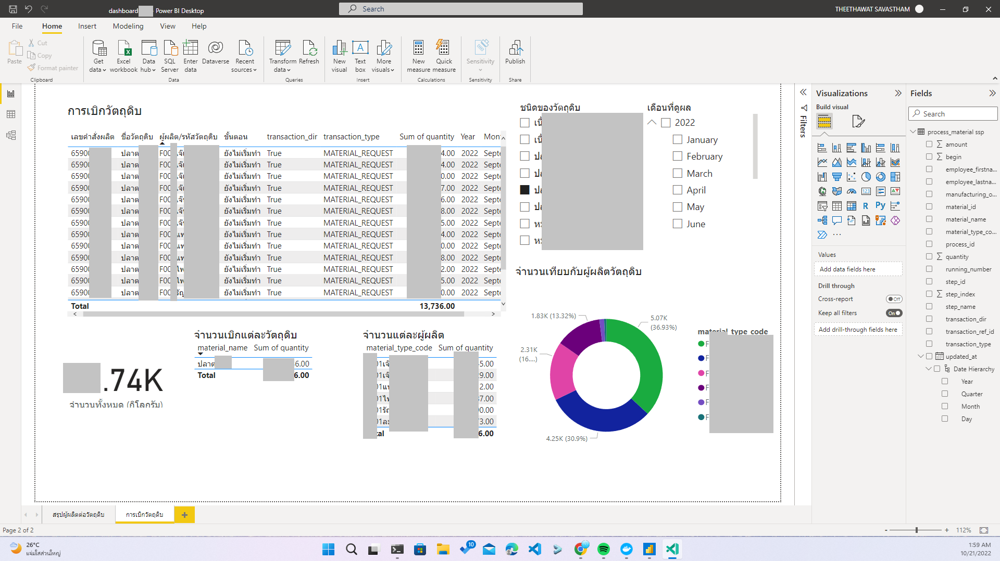

#  Material Report

### Notice

If you are open this repository in PSU GitLab Version - it's open access to all PSU but I have to hide some of personal or commercial data and resulting output or I will show you as demonstration data instead but the trend of data is a lot different compare to the original. You can see the full version of repository with data if you have access credential for IARC-Programing Github Private [Repository](https://github.com/IARC-Programing/ssp-material-analyze). Or for educational purpose you can contact me.

Visit Open Source Version of this project (with some hide and no credential) at [de-final PSU GitLab](https://gitlab.psu.ac.th/6510120026/de-final)

## Overview

1. Data Cleansing and manuipulation using Pandas on Python Notebook [notebooks/Notebook1.ipynb](notebooks/Notebook1.ipynb)
2. Inserting to MariaDB [database](database)
3. Fetching in Microsoft PowerBI and Create the Dashboard [dashboard-ssp.pbix](dashboard-ssp.pbix)


For in Private Repository Version you can visit photo at [unhidevalue-dashboard](unhidevalue-dashboard/)

## Project Setup

1. Initiate Virtual Environment
   ```
   python -m venv venv
   ```
   Activate Virtual Environment (for Windows Powershell)
   ```
   ./venv/Script/Activate.ps1
   ```
2. Install all dependencies on your virtual environment
   ```
   pip install -r requirement.txt
   ```
3. Create .env file by use the format like in `.env.example`

## Folder Structure

- **Notebooks** Trying and Playgroud of my data cleansing, managing and virtualizing before let it be `.py` file and run conditional automatically.
- **Airflows** Automate pipeline of data processing using DAGs with Apache Airflow
- **Database** MariaDB Database Configing with Docker Compose
- **Superset** Link to Git of Apache Superset Monitoring tool use it instead of PowerBI in future work.
